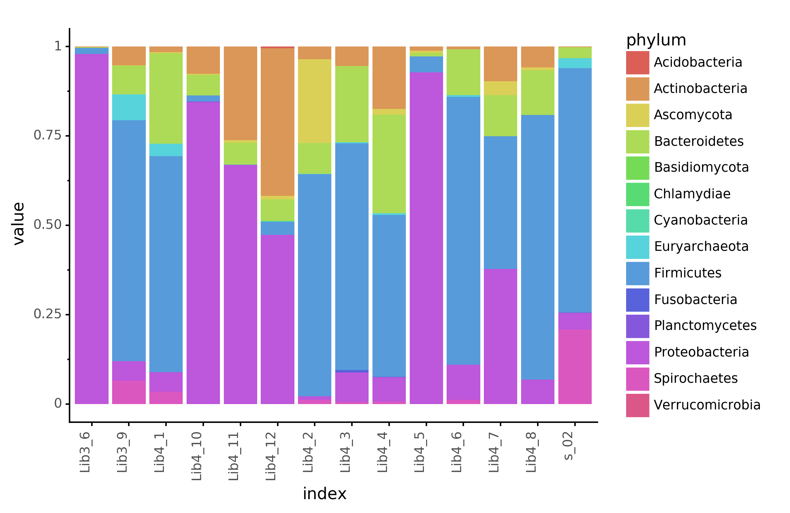

# wibowo_kostic_coprolite

## SourceTracker Analysis

- Selection of curatedMetagenomics samples: [curated_metagenomics/sample_modern_guts.Rmd](curated_metagenomics/sample_modern_guts.Rmd)
- Running metaphlan with [metaphan-nf](https://github.com/maxibor/metaphlan-nf) of [archeological soil-sediments](PRJEB18629)
- Preparing samples for [SourceTracker2](create_st2_inputs.ipynb)
- [Phylum proportions in samples](create_st2_inputs.ipynb)
- [SourceTracker2 results](sourcetracker2)
- References to cite for used samples: [reference.txt](reference.txt)

Fig 1: Phylums proportion in each sample

Fig 2: SourceTracker source estimation

## Sex Determination

- [sex determination](sex_determination)

Fig 3: Sex determination

## [Pydamage v0.2](https://github.com/maxibor/pydamage) results

- Pydamage results, per sample: [pydamage/results](pydamage/results)
- Pydamage JSON file, containing ancient contigs: [pydamage/ancient_contigs.json](pydamage/ancient_contigs.json)  
    - filtered on Qvalue (pvalue corrected for multiple hypothesis testing) < 0.05
    - filtered  on minimum damage > 0.05
    - filtered on contig damage on first base from 5' > mean(damage_first_base_bin) - 2*stdev(damage_first_base_bin)
    - filtered on contig damage on first base from 5' < mean(damage_first_base_bin) + 2*stdev(damage_first_base_bin)
