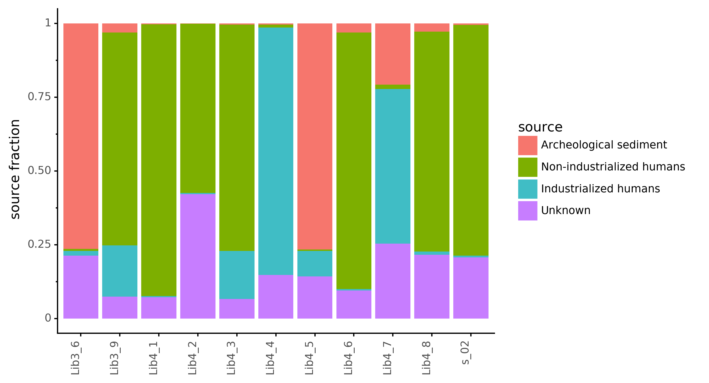

# wibowo_kostic_coprolite

- Selection of curatedMetagenomics samples: [curated_metagenomics/sample_modern_guts.Rmd](curated_metagenomics/sample_modern_guts.Rmd)
- Running metaphlan with [metaphan-nf](https://github.com/maxibor/metaphlan-nf) of [archeological soil-sediments](PRJEB18629)
- Preparing samples for [SourceTracker2](create_st2_inputs.ipynb)
- [SourceTracker2 results](sourcetracker2)

